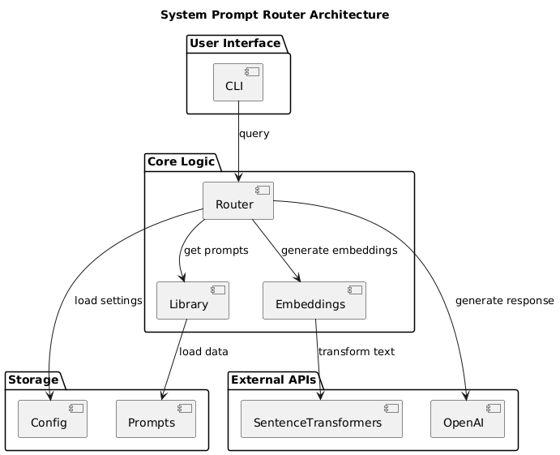
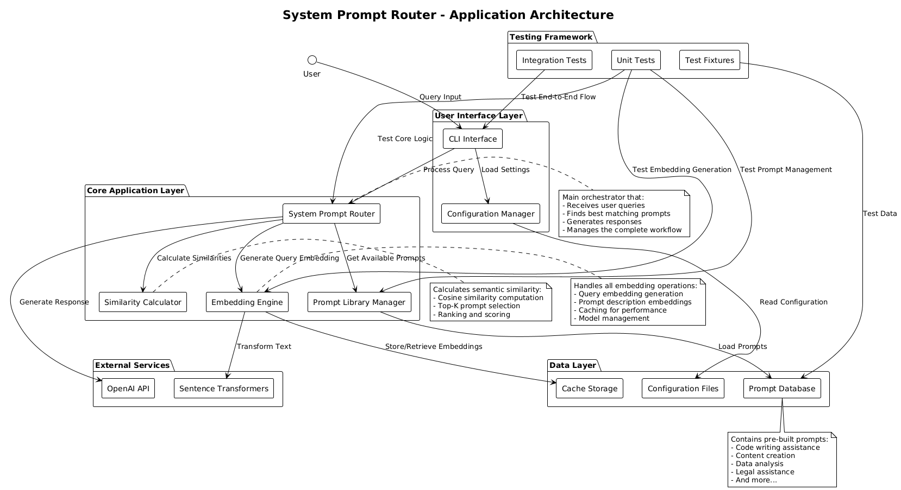

# System Prompt Router

[](https://badge.fury.io/py/system-prompt-router)
[](https://travis-ci.org/user/repo)
[](https://coveralls.io/github/user/repo?branch=main)

**System Prompt Router** is a Python library that intelligently routes user queries to the most appropriate system prompt using semantic similarity. It leverages sentence-transformers to generate high-quality embeddings and provides a flexible framework for building multi-capability AI applications.

This project is designed to help developers create more sophisticated AI systems that can dynamically switch between different prompting strategies based on user intent, leading to more accurate and context-aware responses.

## 🚀 Features

- **Semantic Matching**: Uses sentence-transformers to find the best matching prompt based on query similarity.
- **Extensible Prompt Library**: Comes with a pre-built library of common prompts and makes it easy to add your own.
- **OpenAI Integration**: Seamlessly integrates with OpenAI's API for response generation.
- **Flexible Configuration**: Supports different embedding models, OpenAI models, and similarity metrics.
- **Comprehensive CLI**: Includes a powerful command-line interface for interactive use, batch processing, and configuration management.
- **Performance Optimized**: Features embedding caching and efficient numpy operations for fast similarity matching.
- **Thoroughly Tested**: Includes a comprehensive test suite with pytest, ensuring reliability and correctness.

## Diagram Files

### 1. Architecture Diagram (`architecture_simple.puml`)

**Purpose**: Shows the simple system architecture and component relationships.


### 1. Application Architecture Diagram (`architecture.puml`)

**Purpose**: Shows the overall application architecture and component relationships.


## 📦 Installation

### Prerequisites

- Python 3.8 or higher
- OpenAI API key
- [uv](https://docs.astral.sh/uv/) (recommended) or pip

## 🚀 Installation Methods

### Method 1: Install with uv (Recommended)

**uv** is a fast Python package manager that provides better dependency resolution and faster installs.

#### Install uv first (if not already installed):
```bash
# macOS/Linux
curl -LsSf https://astral.sh/uv/install.sh | sh

# Windows
powershell -c "irm https://astral.sh/uv/install.ps1 | iex"

# Or with pip
pip install uv
```

#### Quick Install from Source:
```bash
# Extract the project (if you have the tarball)
tar -xzf system-prompt-router.tar.gz
cd system-prompt-router

# Install with console scripts enabled
uv pip install -e .

# Set up environment variables
cp .env.example .env
# Edit .env and add your OPENAI_API_KEY
```

#### Install as Global CLI Tool:
```bash
# Install globally using uv tool (makes commands available system-wide)
uv tool install ./system-prompt-router

# Now you can use the commands anywhere:
spr --help
system-prompt-router --help
```

#### Development Install with uv:
```bash
# Create development environment
uv venv --python 3.11
source .venv/bin/activate  # Linux/Mac
# .venv\Scripts\activate  # Windows

# Install in editable mode with dev dependencies
uv pip install -e ".[dev]"

# Or install dependencies separately
uv pip install -e .
uv pip install pytest pytest-cov pytest-mock black flake8 mypy
```

### Method 2: Traditional pip Install

#### From Source:
```bash
# Extract and navigate to project
tar -xzf system-prompt-router.tar.gz
cd system-prompt-router

# Create virtual environment
python -m venv .venv
source .venv/bin/activate  # Linux/Mac
# .venv\Scripts\activate  # Windows

# Install with console scripts
pip install -e .

# Set up environment variables
cp .env.example .env
# Edit .env and add your OPENAI_API_KEY
```

#### Development Install with pip:
```bash
# Install with development dependencies
pip install -e ".[dev]"

# Or install dependencies separately
pip install -e .
pip install pytest pytest-cov pytest-mock black flake8 mypy
```

### Method 3: Install from PyPI (Future)

Once published to PyPI, you'll be able to install with:

```bash
# With uv
uv pip install system-prompt-router

# With pip
pip install system-prompt-router
```

## 🎯 Verify Installation

After installation, verify that the console scripts are working:

```bash
# Test the CLI commands (both should work)
spr --help
system-prompt-router --help

# List available prompts
spr list-prompts

# Validate setup
spr validate

# Test Python import
python -c "from system_prompt_router import SystemPromptRouter; print('✅ Installation successful!')"
```

## ⚙️ Environment Setup

### 1. Set Up Your Environment Variables

Create a `.env` file from the example:

```bash
cp .env.example .env
```

Edit the `.env` file and add your OpenAI API key:

```env
OPENAI_API_KEY=your_openai_api_key_here
OPENAI_MODEL=gpt-3.5-turbo
EMBEDDING_MODEL=all-MiniLM-L6-v2
SIMILARITY_THRESHOLD=0.5
TOP_K_RESULTS=3
```

### 2. Test the Installation

```bash
# Run basic tests
python test_basic.py  # If available

# Run the full test suite
pytest tests/

# Test CLI functionality
spr query "Help me write Python code"
spr query --interactive
```

## 🎯 Quick Start

### 2. Basic Usage (Python)

Here's a simple example of how to use the `SystemPromptRouter` in your Python code:

```python
from system_prompt_router import SystemPromptRouter

# Initialize the router
router = SystemPromptRouter()

# Load the default prompt library
router.load_prompt_library("config/default_prompts.json")

# Define a user query
query = "Write a Python function to sort a list of numbers."

# Find the best matching prompt
matches = router.find_best_prompt(query, top_k=3)

# Print the matches
for name, score, system_prompt in matches:
    print(f"- Prompt: {name}, Score: {score:.4f}")

# Generate a response using the best prompt
response_data = router.generate_response(query)

# Print the response
print("\nResponse:")
print(response_data["response"])
print(f"\nMatched Prompt: {response_data["matched_prompt"]}")
```

### 3. Command-Line Interface (CLI)

The System Prompt Router includes powerful console scripts that are automatically installed during setup. After installation, you can use either command:

- `spr` - Short alias for quick commands
- `system-prompt-router` - Full command name for scripts/documentation

Both commands provide identical functionality and are available system-wide after installation.

#### Available CLI Commands

```bash
# Show help and available commands
spr --help
system-prompt-router --help

# List all available prompts
spr list-prompts

# Validate your setup and configuration
spr validate

# Show detailed statistics
spr stats

# Process queries and batch operations
spr query [OPTIONS] [QUERY]
spr batch [OPTIONS] INPUT_FILE
```

#### Interactive Mode

Start an interactive session to process queries in real-time:

```bash
spr query --interactive
```

Inside interactive mode, you can use commands like:
- `/list` - Show available prompts
- `/stats` - Display router statistics  
- `/help` - Show help information
- `/quit` - Exit interactive mode

#### Single Query Processing

Process a single query directly from the command line:

```bash
spr query "Write a function to calculate Fibonacci numbers."

# With custom options
spr query "Analyze this data" --top-k 5 --method cosine
```

#### Batch Processing

Process multiple queries from a file and save the results:

```bash
# Create a file with one query per line
echo "What is the capital of France?" > queries.txt
echo "Summarize the plot of Hamlet." >> queries.txt
echo "Write a Python sorting function." >> queries.txt

# Run batch processing with different output formats
spr batch queries.txt --output results.json --format json
spr batch queries.txt --output results.csv --format csv
spr batch queries.txt --output results.txt --format txt
```

#### Configuration and Management

```bash
# Validate your setup (checks API keys, models, prompts)
spr validate

# Show detailed statistics about your router
spr stats

# Use custom prompt library
spr query "Help me code" --prompt-library /path/to/custom_prompts.json

# Use custom configuration file
spr --config /path/to/config.yaml query "Your question"
```

## 📚 Prompt Library

The prompt library is a collection of system prompts that the router uses to match against user queries. You can easily create your own library or extend the default one.

### Default Prompts

The library comes with a set of pre-built prompts for common AI capabilities, including:

- `code_writer`: Write, debug, and explain code.
- `data_analyst`: Analyze data and create visualizations.
- `creative_writer`: Write creative content and marketing copy.
- `technical_documentation`: Create technical docs and user guides.
- `business_consultant`: Provide business advice and strategy.
- And more...

### Custom Prompts

You can create your own prompt library in JSON or YAML format. Here's an example of a custom prompt in JSON:

```json
{
  "recipe_helper": {
    "description": "Help with cooking recipes and meal planning",
    "system_prompt": "You are a cooking assistant. Help users with recipe suggestions, cooking techniques, and meal planning."
  }
}
```

To use your custom library, pass the file path to the `load_prompt_library` method or use the `--prompt-library` option in the CLI.

## ⚙️ Configuration

System Prompt Router is highly configurable. You can customize its behavior using a configuration file (`config.yaml`) or environment variables.

### Configuration File

Create a `config.yaml` file in your project root to override default settings:

```yaml
embedding_model: "all-mpnet-base-v2"
openai_model: "gpt-4"
similarity_threshold: 0.6
top_k_results: 5
```

### Environment Variables

You can also configure the router using environment variables. These will override any settings in the configuration file.

- `OPENAI_API_KEY`: Your OpenAI API key (required).
- `EMBEDDING_MODEL`: The sentence-transformer model to use.
- `OPENAI_MODEL`: The OpenAI model to use for response generation.
- `SIMILARITY_THRESHOLD`: The minimum similarity score for a match.
- `TOP_K_RESULTS`: The number of top matches to return.

## 🔧 API Reference

### `SystemPromptRouter`

The main class for interacting with the router.

- `__init__(config, embedding_model, openai_model, openai_api_key)`: Initialize the router.
- `add_prompt(name, description, system_prompt, metadata)`: Add a single prompt.
- `load_prompt_library(prompts)`: Load prompts from a dictionary or file.
- `find_best_prompt(user_query, top_k, method, return_scores)`: Find best matching prompts.
- `generate_response(user_query, use_best_prompt, custom_system_prompt, max_tokens, temperature)`: Generate a response.
- `list_prompts()`: List all available prompts.
- `get_stats()`: Get statistics about the router and its components.

### `PromptLibrary`

Manages the collection of prompts.

- `add_prompt(name, description, system_prompt, metadata)`: Add a single prompt.
- `load_from_dict(prompts_dict)`: Load prompts from a dictionary.
- `load_from_json(file_path)`: Load prompts from a JSON file.
- `save_to_json(file_path)`: Save prompts to a JSON file.

## 🧪 Testing

The project includes a comprehensive test suite using pytest. To run the tests, first install the development dependencies:

```bash
pip install -e .[dev]
```

Then, run the test suite:

```bash
pytest
```

To see test coverage, run:

```bash
pytest --cov=src
```

## 📈 Performance

- **Matching Speed**: ~1000 queries/second on modern hardware, thanks to efficient numpy operations.
- **Memory Usage**: ~50MB for the default embedding model (`all-MiniLM-L6-v2`).
- **Accuracy**: High semantic matching accuracy with well-crafted prompt descriptions.
- **Caching**: Embedding caching significantly improves performance for repeated queries and prompt descriptions.

## 🤝 Contributing

Contributions are welcome! If you'd like to contribute, please follow these steps:

1.  Fork the repository.
2.  Create a new feature branch (`git checkout -b feature/your-feature`).
3.  Make your changes and add tests.
4.  Ensure all tests pass (`pytest`).
5.  Submit a pull request with a clear description of your changes.

## 📄 License

This project is licensed under the MIT License. See the [LICENSE](LICENSE) file for details.

## 🙏 Acknowledgments

- Built with [sentence-transformers](https://www.sbert.net/).
- Powered by the [OpenAI API](https://beta.openai.com/docs/).
- Inspired by the need for more dynamic and intelligent AI applications.

## 📞 Support

If you have any questions or encounter any issues, please:

1.  Check the examples in the `examples/` directory.
2.  Review the CLI help: `spr --help`.
3.  Open an issue on GitHub.
